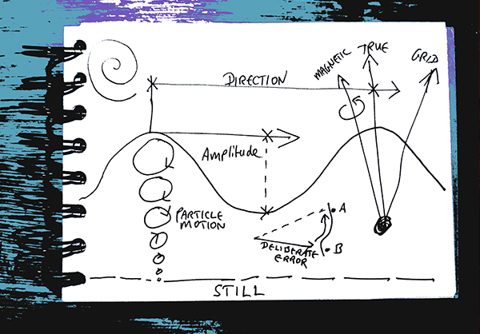

---
title:
feature_image: "/assets/images/pianoweb1e.jpg"
feature_text: |
  # DisplacementActivities
---
"Go back. What was must never be"---Alan Garner, *Thursbitch*, 2003 

"Mickey Mouse has grown up a cow"---David Bowie, *Life on Mars?*, 1971 

“Never mind about the Russians. Mr. Gridley has become much more of a menace”---Franklyn Ambruster in *The Notorius Landlady*, 1962 

On October 27th, 1962, my father grabbed a few possessions, my mother and myself, piled us into the car and we set off for Cheddar Gorge, a journey of around 170 miles. Back to the cave. 
 
The Cuban Missile Crisis occurred between 16th Oct 1962 – 29th Oct 1962, shortly after *The Notorious Landlady* was released.

 Everything is undergoing some form of displacement: we know this. The unending procession of human displacement through war and/or ecocide shades our understanding; our own mortal journey edging towards darkness or light might be something we choose not to face. Our social and existential fabrics echo one another and mirror material decay and disintegration as buildings collapse into rising waters or flames. Decisions must be made with little or no time to measure consequeces. A case of improvisation with positive intent. This might not work, but...
 
 When I first identified DisplacementActivities as a method, it was an attempt to engage directly with things beyond my control, things I was advised to avoid. Inconvenient truths, awkward moments. Yet our general coping strategies could readily be seen as displacement activities in themselves. That's how it felt when my research hit an institutional wall, anything I did would be a displacement activity. Rather than give up, I went sideways, and hoisted the flag for DisplacementActivities and a positive response, a resistance to seemingly immoveable forces. 
 
Where do these resistive practices come from? Earlier on we may have noticed the whirring of the air conditioning system falling silent when we weren't actually aware of the sound it was making beforehand. The sound only came into being for us when it ceased. In the sound world, this phenomenon is called 'remanence' (Jean-François Augoyard, 2005). Aside from the odd perceived lacuna, Displacements are a constant in and on every level. Thus, methods of DisplacementActivities spotaneously emerge as a form of knowing, more precisely *unknowing*, as I have argued elsewhere.
 
 Pursuing this approach, my main modes of practice oscillate between sound, text and performance. These modes are often combined, glued together by images or symbols. Alongside this, walking is a constant and productive inspiration. Around 1999, I began to focus on location-based ambulant sound as a form of memory, and this began to shape a lot of my subsequent activity. Examples of this work are my series of [DisplacementActivities](https://displacementactivities1.wordpress.com/2018/02/14/thetraverse/), a form of trans-locational performance. More recently, I collaborated with Adje Both on [Sounds of Teotihuacan](https://teosoundmap.com/), a calmer form of GPS-based acoustic archaeology with Adje Both, producing a geo-located experience drawing ancient sounds from the sacred site. The latest ongoing experiment along these lines, is literally along lines: *The Barrow Alignment*, which traces lines to and from Barrow Park in relation to the declination of magnetic north, collaborating with Jonathan Lindh and sponsored by [Full of Noises](https://www.fonfestival.org/)(FoN). This work has resulted in an Arts Council England DYCP grant enabling me to explore geomagnetism and ambisonics [update here](https://www.displacementactivities.org/projects/sound/2025/03/21/geoambo/).
 
A key aspect of sound is its ability to penetrate deeply while remaining fleeting. Periodic ritual walking echoes this quality by heightening our awareness of Deep Time as an infinitesimal process experienced constantly yet seldom noticed. Ultimately, an openness to small variations within a vast ongoing improvisation is all that is necessary. Listen, and ye shall find! 

Politics is most likely immanent in any art form, but particularly in one that engages with boundaries and edges, improvising freely with both human and non-human forms of obstruction. Tiny movements have the potential to be revolutionary---persistence of direction pervading through oscillation, akin to Henri Lefebvre's 'moments'. In a world where so many are compelled to move, any alignment with the [human flow](http://www.humanflow.com/action/) is plainly political. Otherwise, we end up in a 'Don't mention the war' situation, already satirised hilariously by Cleese and Booth in *Fawlty Towers*, back in the 1970s. Perhaps even that reference is questionable now, in today's toxic climate of racism. How many parentheses and scare quotes do we need around 'not mentioning the war' these days? Times have moved on, or are we simply sliding backwards? What would backwards amount to? A hill of beans? Perhaps this diagram holds the key:
 
 

  

I have a vague recollection that there was an incident involving a sudden trip to my grandparents in Yeovil. I remember a sense of good-humoured panic. I think it was the first time I'd ever been to Cheddar Gorge. I only understood the full extent of DisplcementActivities at work many years later, when my father told me about the terrible precarity of the Cuban Missile Crisis that day, and his motivations for urgent action. It was one of those vanishingly few occasions when I looked upon him with a deep feeling of pride.  

 vimeo: [simon bradley](https://vimeo.com/user6604380)  
 insta/threads: [@simonbrdly](https://www.instagram.com/simonbrdly)  
 bandcamp: [simonbradley](https://simonbradley.bandcamp.com/)  
 collaborations:  
 vimeo: [ArtCouple](https://vimeo.com/user127952551)  
 bandcamp: [ESS<>GEE](https://essgee1.bandcamp.com/)   

  

